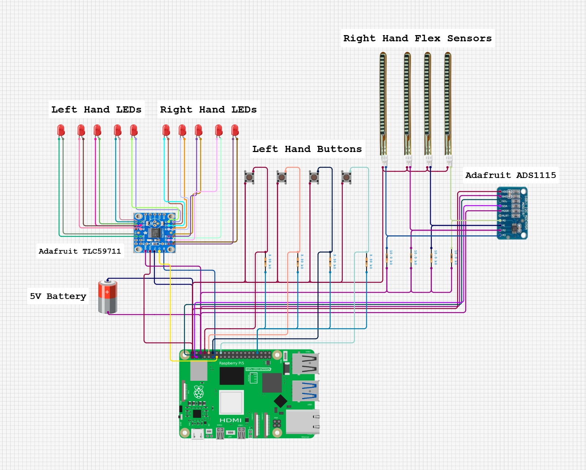

# DigitSynth

> A real-time wearable audio effects processor built on Raspberry Pi — apply filters and effects to live audio using MIDI control messages with responsive LEDs.

---
##  Features

-  Real-time EQ and filtering control for a MIDI synthesiser
-  Low-latency digital signal processing on Raspberry Pi
-  Hardware controls for intuitive parameter adjustment
-  MIDI CC output with adjustable filter parameters
-  Responsive LEDs that react in real-time to parameter changes
-  Open source and fully reproducible
---
## Hardware Requirements
 
### Bill of Materials

The table below outlines the hardware components used in this project. Exact component matches are not required, and suitable alternatives will yield comparable results. However, as the software has been developed specifically for the Raspberry Pi, it is strongly recommended to retain this as the target platform.
 
| Component | Part Number | Quantity | Approx. Cost (unit)|
|---|---|---|---|
| Raspberry Pi 5 | Pi 5 8GB | 1 | £161.53 |
| Adafruit ADS1115 | 1085 | 1 | £11.18 |
| Adafruit TLC59711 | 1455 | 1 | £6.73 |
| Spectra Symbol Flex Sensor FLX| FLX-L-055-123-MP | 4 | £8.51 |
| Tactile Switch, 4.3mm, 160g | MCDTS2-1N| 4 | £0.17 |
| Kingbright L-7113IT 5mm 2V Red LED 80mcd | 56-0250 | 10 | £0.08 |
| Pisugar S Plus 5000 mAh Raspberry Pi UPS | Pisugar S Plus | 1 | $29.99 |

A MIDI-receiving device is required to complete the setup, either a hardware synthesiser or a software synthesiser running on a connected laptop. In this project, a Roland JD-Xi synthesiser was used, receiving MIDI directly from the Raspberry Pi over USB-B.

Wiring Diagram:



---
## Software Requirements

### Toolchain
Our build system is CMake, but we provide a simple top-level Makefile to make things easy. Feel free to run the `cmake` commands manually if you are so inclined. 

### 1. Clone the Repository
 
```bash
git clone https://github.com/RTES-Group/DigitSynth.git
cd DigitSynth
```

### 2. Install Dependencies

#### Dependencies

| Library | Purpose | Source |
|---|---|---|
| IIR Filter Library | Digital IIR filter design and processing | [berndporr/iir1](https://github.com/berndporr/iir1) |
| RtMidi | Real-time MIDI input/output | [thestk/rtmidi](https://github.com/thestk/rtmidi) |
| ADS1115 API | Flex sensor measurement | [berndporr/rpi_ads1115](github.com/berndporr/rpi_ads1115) |
| libgpiod | GPIO management | [ligpiod](https://libgpiod.readthedocs.io/en/latest/building.html) | 

Simply run the `install-deps.sh` script:
```bash 
./install-deps.sh
```

### 3. Enable SPI on the Raspberry Pi:
SPI must be enabled before the project will run:

```bash
sudo raspi-config
gpio i2cd
# Navigate to: Interface Options → SPI → Enable
```

### 4. Build the project:

```bash
make
```

### 5. Run:
```bash
build/digitsynth
```

---

## Unit tests

To run unit tests: 
```bash 
make test
```

---

# Contributing

See the issues tab for a list of potential contributions. In particular we would welcome expanding support for other synths. 

---

Follow our build journey on Instagram: [](https://instagram.com/digitsynth_)

---
## License

This project is licensed under the **MIT License** — see the [`LICENSE`](LICENSE) file for details.
 
You are free to use, modify, and distribute this project. We just ask that you credit the original authors.

---

## Authors & Acknowledgements

Developed by:

- **Logan Brown** — [GitHub](https://github.com/LoganBrownGU)
- **Becky Clarke** — [GitHub](https://github.com/Becky2603)
- **Dougal Harris** — [GitHub](https://github.com/DougalH1)
- **Finn McConville** — [GitHub](https://github.com/finnmcco)
- **Jamie Wedlinscky** — [GitHub](https://github.com/jwedlinscky)
  
As part of the **Real-Time Embedded Systems** module at **University of Glasgow**, *2026*.


